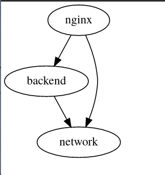
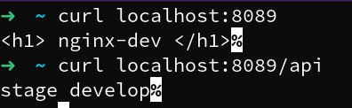

# Info
This repo, my practice for use terragrunt.Taken as a basis example gruntwork.io team [link](https://github.com/gruntwork-io/terragrunt-infrastructure-live-example). Use [docker](https://github.com/kreuzwerker/terraform-provider-docker) provider for start instances.
state use [localstack](https://localstack.cloud/)
s3 bucket.<br> 
### Architecture
view tree folders
```
├── env
│   └── dev
│       ├── backend
│       │   └── terragrunt.hcl
│       ├── env.hcl
│       ├── host.hcl
│       ├── network
│       │   └── terragrunt.hcl
│       └── nginx
│           └── terragrunt.hcl
├── modules
│   ├── backend
│   │   ├── main.tf
│   │   ├── output.tf
│   │   └── variables.tf
│   ├── network
│   │   ├── main.tf
│   │   ├── output.tf
│   │   └── variables.tf
│   └── nginx
│       ├── main.tf
│       ├── template
│       │   ├── default.conf
│       │   ├── index.html
│       │   └── nginx.conf
│       └── variables.tf
├── service
│   ├── backend.hcl
│   ├── network.hcl
│   └── nginx.hcl

```
### modules
modules is you instances described by terraform
for terragrunt they can be place other remote repo
### services
service described input environment variables for terraform modules 
### env
environment variable infrastructure *env.hcl* global variables, followed by usage in service
```hcl
locals {
  backend = {
    env = "develop" 
    port = 8080
  }
  network = {
    name = "terragrunt-simple"
  }
  name = "dev"
  port = 8089
  path_site = "/var/terragrunt-simple"
} 
```
host.hcl you ip for used provider docker ssh
```hcl
locals {
  ip = "127.0.0.1"
  user = "root"
}
```
example nginx instance 
```
dependency "backend" {
  config_path =  "${find_in_parent_folders("backend")}"

   mock_outputs = {
    docker_run = true
  }
}

dependency "network" {
  config_path = "${find_in_parent_folders("network")}"
}

inputs = {

  docker_newtork_id = dependency.network.outputs.id
  backend_hostname = dependency.backend.outputs.docker_ip[0]
}
```
nginx wait module backend and network for start this simple example execution queue <br>



# RUN 
## develop shell
for easy install requirements package and init
scripts need install
[nix-shell](https://nixos.org/download.html) 
then exec develop shell command
```bash
nix-shell
```
## init
up local s3 bucket and create s3 url for terraform
bucket state by [localstack](https://localstack.cloud/) 
```bash
init 
```
## start
apply simple example dev environment by command and wait
```bash
cd env/dev && terragrunt run-all apply 
```
## result 
result you have 2 docker container nginx and backend
test healthcheck by curl 

